# Retos 
## Identifica los elementos de navegación en los siguientes sites
### BREATHER
 * Navegación global  
 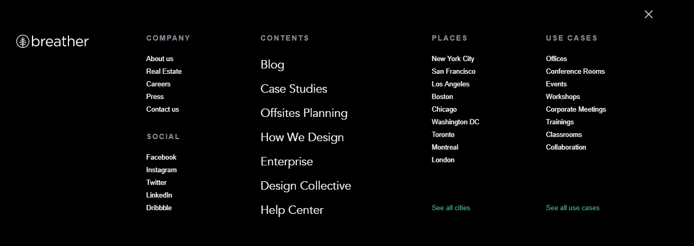
 * Navegación local  
  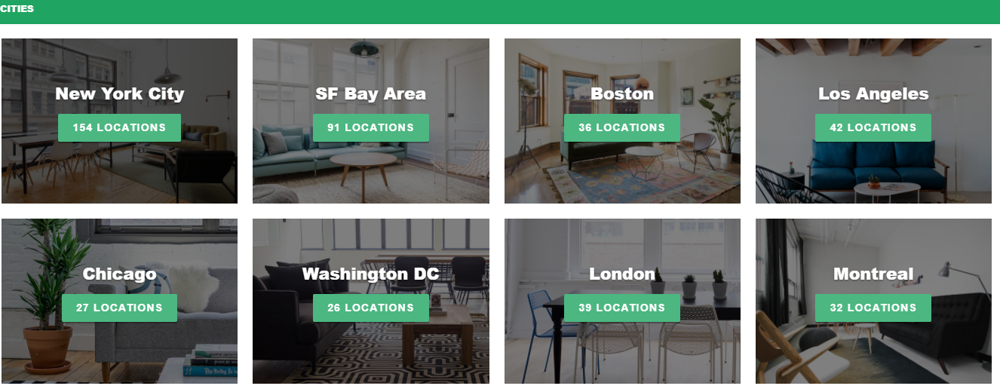
 * Filtros  
  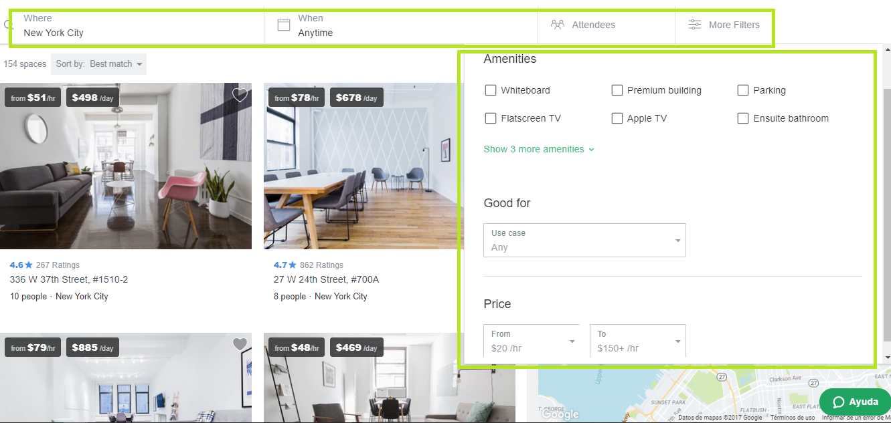
 * Navegación en línea  
 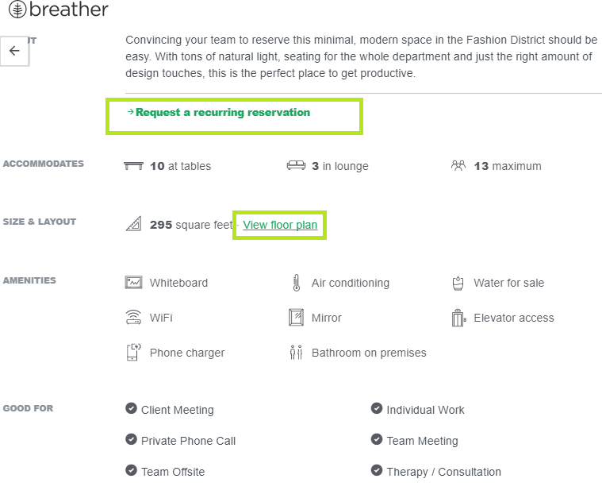

 ### GITHUB
  * Navegación global  
 
 * Navegación local  
  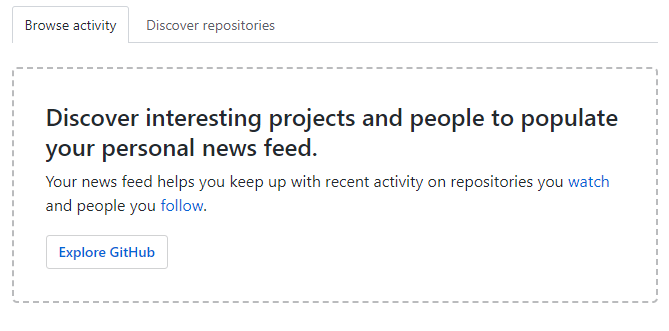
 * Filtros  
  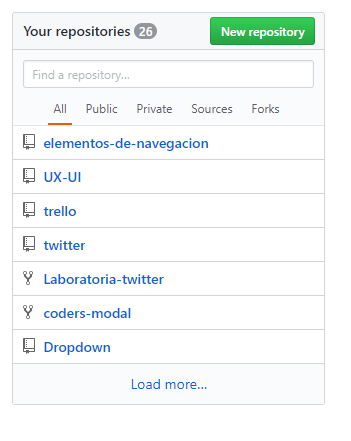
  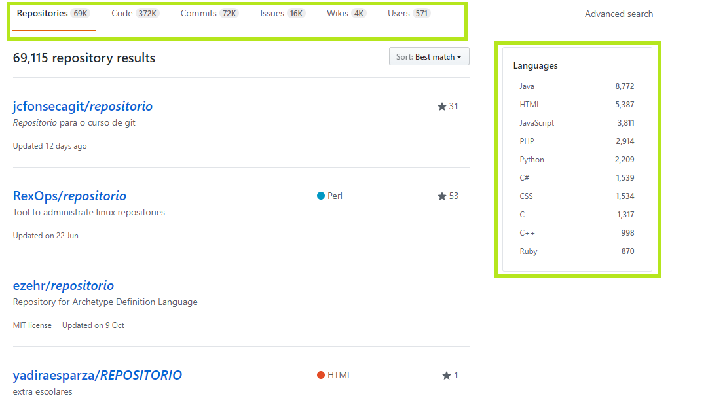  
 * Navegación en línea  
 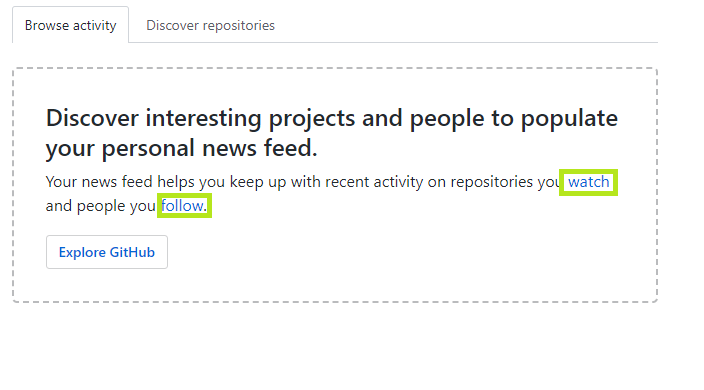

### MEDIUM
 * Navegación global  
 
 * Navegación local  
  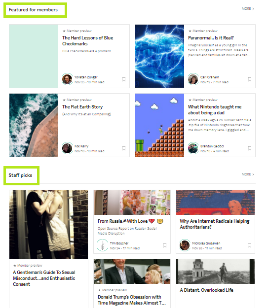
 * Navegación facetada  
  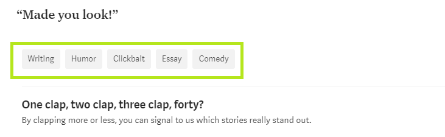
 * Navegación contextual  
 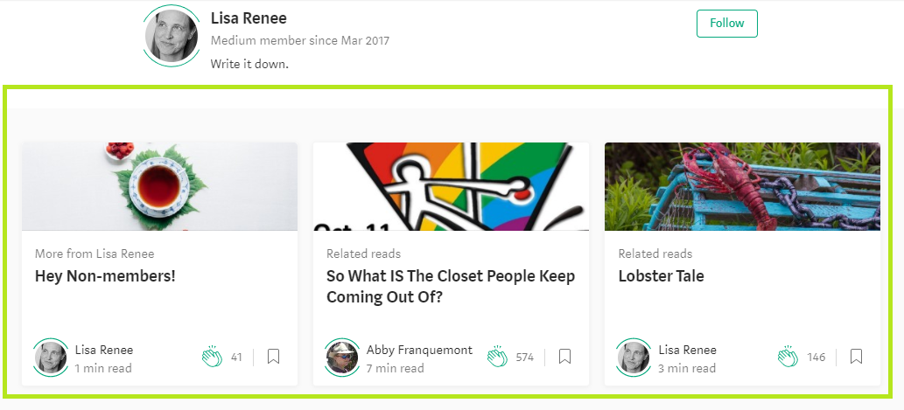
 * Navegación en línea  
 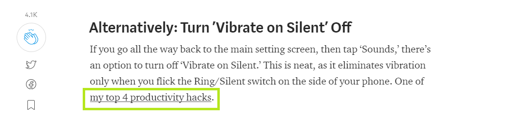